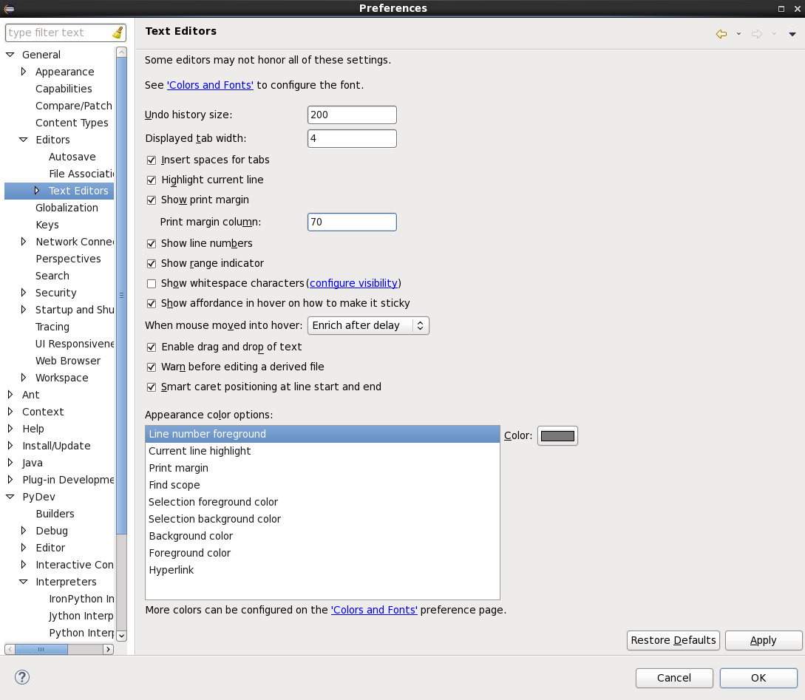

# Getting Started With the *oss-automatic-bug-assignment* Repository

This repository contains the source code used in the experiments of
the Master's Thesis "Tuning of machine learning algorithms for
automatic bug assignment" (Daniel Artchounin), conducted on the
following open-source software projects: Eclipse JDT and Mozilla
Firefox. In this Master's Thesis, a systematic four-step method to
find some of the best configurations of several machine learning
algorithms intending to solve the automatic bug assignment problem has
been introduced. This method has been evaluated on 66 066 bug reports
of Ericsson, 24 450 bug reports of Eclipse JDT and 30 358 bug reports
of Mozilla Firefox.

## Installation of Python 3.6 in a virtual environment

Below, there are the instructions to follow in order to install Python
3.6 in a virtual environment:

1. Go to the following web page:
    * [https://pypi.python.org/pypi/virtualenv](https://pypi.python.org/pypi/virtualenv)

2. Download the TAR.GZ file:
    * virtualenv-<desired_version>.tar.gz

3. Untar the aforementioned TAR.GZ file:

   ```console
   tar xvfz virtualenv-<downloaded_version>.tar.gz
   ```

4. Move to the folder with the content extracted from the TAR.GZ file
   (using your terminal)

5. Create a virtual environment:

   ```console
   python3.6 virtualenv.py <fancy_name_of_your_virtual_environment>
   # example: python3.6 virtualenv.py yo
   ```

6. Move to the folder of your virtual environment with the
   executables:

   ```console
   cd <fancy_name_of_your_virtual_environment>/bin/
   ```

7. Read and execute commands from the activate.csh script in your
   current shell environment (it will activate your virtual
   environment):

   ```console
   source activate
   ```

8. Normally, you should see the fancy name of your virtual environment
   in your shell prompt. If this is the case, you have correctly
   installed Python 3.6 in a virtual environment. If not, you should
   go back to one of the previous steps.

## Installation of the required packages in your Python 3.6 virtual environment

Below, there are the instructions to follow in order to install
packages in your Python 3.6 virtual environment:

1. First, activate your virtual environment:

   ```console
   source activate
   ```

2. Install the following packages:

   ```console
   pip install matplotlib
   pip install nltk
   pip install numpy
   pip install pandas
   pip install scikit-learn==0.18.1
   pip install scipy
   pip install scrapy
   pip install seaborn
   pip install sphinx
   pip install wordcloud
   pip install selenium
   ```

3. Now, verify that you have correctly installed the above-mentioned
   packages:

    1. Start the Python interpreter with the following command line:

       ```console
       python
       ```

    2. Copy/paste the following lines in your interpreter

       ```python
       import matplotlib
       import nltk
       import numpy
       import pandas
       import sklearn
       import scipy
       import scrapy
       import seaborn
       import sphinx
       import wordcloud
       import selenium
       ```

    3. If you get an error message, please go back to the step 1.

    4. Copy/paste the code in [this
       page](http://scikit-learn.org/stable/auto_examples/plot_cv_predict.html#sphx-glr-auto-examples-plot-cv-predict-py)
       in your Python interpreter. Normally, a window with a cool
       chart should be opened.

       If not, you might have to change a specific line of the file:
       `<the_path_to_your_fancy_virtual_environment>/lib/python3.6/site-packages/matplotlib/mpl-data/matplotlibrc`.
       You should have a line (inside of it) that looks like the
       following line:

       ```
       backend: TkAgg
       ```

    5. Copy/paste the following piece of code in your Python
       interpreter (it will download all the NLTK data packages):

       ```python
       import nltk

       nltk.download(“all”, download_dir=”/home/nltk_data”)
       ```
       If you need to disable SSL verification, copy/paste the
       following piece of code in your Python interpreter instead:

       ```python
       import nltk
       import ssl

       try:
           _create_unverified_https_context = ssl._create_unverified_context
       except AttributeError:
           pass
       else:
           ssl._create_default_https_context = _create_unverified_https_context
       nltk.download(“all”, download_dir=”/home/nltk_data”)
       ```

## Run the code in the *oss-automatic-bug-assignment* repository

Below, there are the instructions to follow in order to be able to run
the code in the *oss-automatic-bug-assignment* repository:

1. Clone the repository:

   ```console
   git clone https://github.com/Ericsson/oss-automatic-bug-assignment.git
   ```

2. Follow the instructions on [this
   page](http://python.bw.org/pydev-installation/) to install Eclipse
   and PyDev

3. Once, you are done with the above-mentioned installation, switch to
   PyDev on Eclipse

4. Then, open the *oss-automatic-bug-assignment* repository from your
   local copy by opening the window *Import Projects from File System
   or Archive* in *File > Open Projects from File System...* on
   Eclipse

5. Select the correct folder

6. Click on the *Finish* button

7. After having imported the project, you should have a cross with a
   red background on the left of the interpreter in the *PyDev Package
   Explorer*

8. To fix that, open the *Properties* window of the project

9. Move to *PyDev-Interpreter/Grammar* using the vertical navigation
   bar on the left of the window

10. Then, click on the *Click here to configure an interpreter not
    listed* link (or on the *Please configure an interpreter before
    proceeding.* link followed by a click on the *Manual Config*
    button)

11. Click on the *New* button

12. Click on the *Browse...* button

13. Select the executable of your Python 3.6 interpreter installed in
    your virtual environment. Don't forget to click on the *OK* button
    then

14. Then, click on the *Apply* button. You will have to wait a bit...

15. Click on the *OK* button

16. Select your interpreter in the *Interpreter* drop-down list

17. Don't forget to click on the *Apply* button. Then, click on the
    *OK* button

18. Open the *Text Editors* window which is here: *Window >
    Preferences >Editors*. Update your preferences based on the
    following screenshot:

    

19. Don't forget to click on the *Apply* and *OK* buttons

20. Move to your local copy of the *oss-automatic-bug-assignment*
    repository (with your console)

21. Type the following command:

    ```console
    cp src/final_results/mozilla_firefox/pre_processing_experiments/output_without_cleaning_without_stemming_without_lemmatizing_without_stop_words_removal_without_punctuation_removal_without_numbers_removal.json src/mozilla_firefox/pre_processing_experiments/
    ```

22. Open the *classify.py* file in the
    *oss-automatic-bug-assignment/src/* folder. This module is used to
    conduct some minor experiments

25. Run it and enjoy! Normally, you should not get any error messages.

## Dependencies of the project

The source code has been written Python 3.6. Below, there are the
dependencies of the project:

* matplotlib

* nltk

* numpy

* pandas

* scikit-learn==0.18.1

* scipy

* scrapy

* seaborn

* sphinx

* wordcloud

* selenium

## (Re-)generate the documentation of the *oss-automatic-bug-assignment* repository

The section describes how to generate or re-generate the *oss-automatic-bug-assignment* repository.

The files (*doc/source/\*.rst*, *doc/Makefile*, *doc/make.bat* and
*doc/source/conf.py*) needed to generate the documentation are indexed
by Git and have been pushed to the remote repository.

If one modifies the code base, the above-mentioned files will have to
be re-generated. To do that, one will have to follow the instructions
below:

1. Move to your local copy of the *oss-automatic-bug-assignment*
   repository (with your console)

2. Type the following command line to delete the *doc* folder and all
   its files recursively (be careful when you type it):

   ```console
   rm -rf doc/
   ```

3. Then, verify if you need to update the content of the
   *setup_files_for_doc.bash* file (more precisely, the content
   related to the step iv)). This Bash script is used to generate the
   files needed to generate the documentation. More precisely it does
   the following things:

    1. First, it will launch the
       [sphinx-quickstart](http://www.sphinx-doc.org/en/stable/invocation.html)
       script. You will have to type the following things during the
       execution of the script:

        1. doc
        2. y
        3. _
        4. OSS Automatic Bug Assignment
        5. Daniel Artchounin, Ola Leifler and Daniel Nilsson
        6. 1.0
        7. 1.0
        8. en
        9. .rst
        10. index
        11. y
        12. y
        13. y
        14. y
        15. y
        16. y
        17. y
        18. y
        19. y
        20. y
        21. y
        22. y
        23. y

    2. The script will then print *Please modify the conf.py file
       before continuing*. You will have to modify the
       *doc/source/conf.py* file and have to replace the following
       lines inside of it:

       ```python
       # import os
       # import sys
       # sys.path.insert(0, os.path.abspath('.'))
       ```

       by

       ```python
       import os
       import sys
       sys.path.insert(0, os.path.abspath('../../src'))
       ```

    3. You will have to press a key to continue the execution of the
       script

    4. Next, the script really generates the files needed to generate
       the documentation using the *sphinx-apidoc* tool. Then, this
       script modifies 4 RST files (to improve the quality of the
       documentation):

        * *doc/source/index.rst*: the master document used to generate
          the documentation. It contains the main [TOC
          tree](http://www.sphinx-doc.org/en/stable/markup/toctree.html).
          This TOC tree mainly includes the *doc/source/modules.rst*
          document;

        * *doc/source/modules.rst*: the document which contains a
          sub-TOC tree which includes the documents related to each
          package of the *oss-automatic-bug-assignment/src* folder;

        * */doc/source/eclipse_jdt.rst*: the document which is used to
          generate the documentation of the
          *oss-automatic-bug-assignment/src/eclipse_jdt* folder

        * */doc/source/mozilla_firefox.rst*: the document which is
          used to generate the documentation of the
          *oss-automatic-bug-assignment/src/mozilla_firefox* folder

        * *doc/source/scikit_learn.rst*: the document which is used to
          generate the documentation of the
          *oss-automatic-bug-assignment/src/scikit_learn* folder

       Before executing the Bash script, you will have to update its
       content based on the modifications you have made (if you have
       removed a Python module mentioned in the script, if you have
       renamed a Python module mentioned in the script or added a
       Python module which should be mentioned in the script).

    5. Then, it will ask you whether or not it should generate the
       HTML documentation. You will just have to type *y*. The HTML
       documentation will be in the *doc/build/html* folder

If one wants to only re-generate the HTML documentation without
modifying the files needed to generate it (*doc/source/*.rst*,
*doc/Makefile*, *doc/make.bat* and *doc/source/conf.py*), one will
have to follow the instructions below:

1. Move to the *edanart/doc* folder (with the terminal)

2. Then, type the following command line to generate the HTML
   documentation:

   ```console
   make html
   ```

## Organization

Below, the organization of the repository is described:

* *eclipse_jdt/*: contains the code base related to the Eclipse JDT
  project;

* *mozilla_firefox/*: contains the code base related to the Mozilla
  Firefox project.

## Eclipse JDT

### Scrapy

Below, there are some useful command lines to get started with Scrapy:

* `cd eclipse_jdt/scrap_eclipse_jdt/`: move to the relevant folder;

* `scrapy crawl eclipse_jdt -o brs.json`: run the Eclipse JDT spider
  and store the scrapped data into a JSON file.

## Mozilla Firefox

### Scrapy

Below, there are some useful command lines to get started with Scrapy:

* `cd mozilla_firefox/scrap_mozilla_firefox/`: move to the relevant
  folder;

* `scrapy crawl mozilla_firefox -o brs.json`: run the Mozilla Firefox
  spider and store the scrapped data into a JSON file.